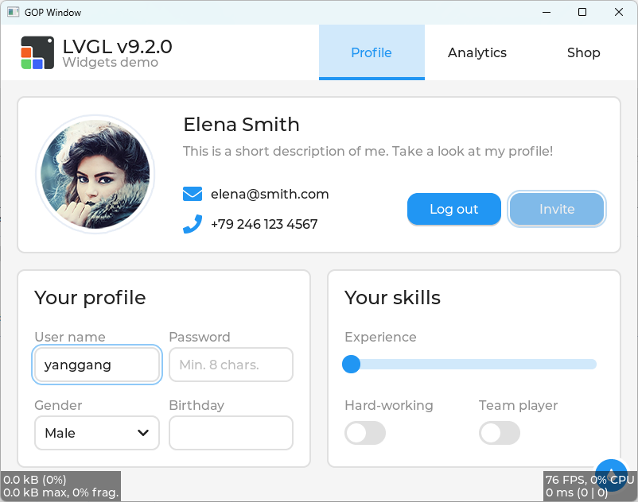

# [LVGL](https://github.com/lvgl/lvgl) on UEFI Environment.

## Build

```
build -p LvglPkg\LvglPkg.dsc -m LvglPkg\LvglApp\LvglApp.inf -a X64 -t VS2015x86 -b RELEASE
```



### Demo Download

[LvglApp.efi](./Demo/Bin/LvglApp.efi)

### Demo Usage

1. Download [OVMF.fd](./Demo/Bin/OVMF.fd)
2. Create EfiFiles folder and copy [LvglApp.efi](./Demo/Bin/LvglApp.efi) to it
3. qemu-system-x86_64.exe -bios OVMF.fd -hda fat:rw:EfiFiles -net none -usb -device usb-mouse -serial file:./log.txt
4. Boot to UEFI Shell
5. `fs0:` then [Enter], `LvglApp.efi` then [Enter]
6. Press `Esc` to exit `LvglApp.efi`

## TODO
- [x] Absolute Pointer Mouse
- [x] Simple Pointer Mouse
- [ ] Mouse Wheel
- [ ] Demo Selection
- [ ] ...

## Note
1. For Edk2 EmulatorPkg user, use the RELEASE build or build LvglPkg/LvglApp/LvglApp.inf in EmulatorPkg.dsc