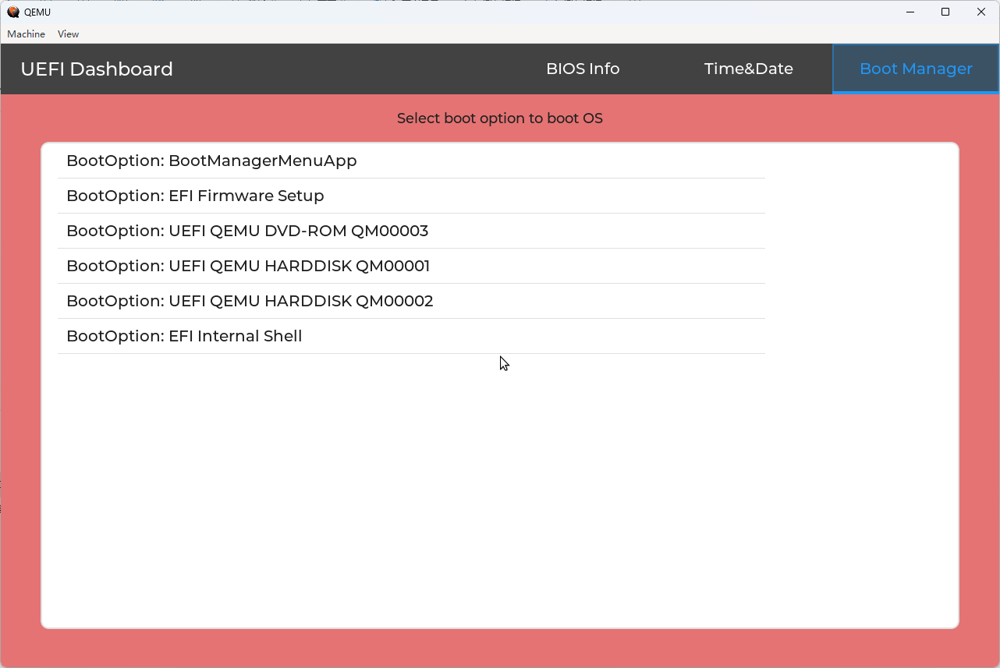

# [LVGL](https://github.com/lvgl/lvgl) on UEFI Environment.

## Build

#### X64-MSVC
```
build -p LvglPkg\LvglPkg.dsc -a X64 -t VS2022 -b RELEASE
```

#### AARCH64-GCC
```
export GCC5_AARCH64_PREFIX=aarch64-none-linux-gnu-
. edksetup.sh
build -p LvglPkg/LvglPkg.dsc -a AARCH64 -t GCC5 -b RELEASE
```

## LvglLib Usage

1. Include LvglLib like other UEFI Library Class in your UEFI_APPLICATION
2. In App ENTRY_POINT:
   - ~~Call `UefiLvglInit()` to do init~~
   - Call `UefiLvglAppRegister (MyApp)` to show `MyApp`
   - ~~Call `UefiLvglDeinit()` to do deinit, and you may need another code to do clear up for `MyApp`~~

## Demo

- [UefiDashboard.efi](./Demo/Bin/UefiDashboard.efi)
  
  
  

### Demo Usage

1. Download [OVMF.fd](./Demo/Bin/OVMF.fd)
2. Create EfiFiles folder and copy `UefiDashboard.efi` binary to it
3. qemu-system-x86_64.exe -bios OVMF.fd -hda fat:rw:EfiFiles -net none -usb -device usb-mouse -serial stdio
4. Boot to UEFI Shell
5. `fs0:` then [Enter], `UefiDashboard.efi` then [Enter]
6. Press `Esc` to exit `UefiDashboard`

## TODO
- [x] Absolute Pointer Mouse
- [x] Simple Pointer Mouse
- [ ] Mouse Wheel
- [x] Log/Debug Print
- [ ] File System
- [ ] ~~VS2022~~/~~AARCH64-GCC~~/Clang
- [ ] Code Clean(Remove Unused Source File in .inf)
- [ ] ...

## Note
1. For Edk2 EmulatorPkg user, use the RELEASE build or build LvglPkg/Application/LvglDemoApp.inf in EmulatorPkg.dsc
